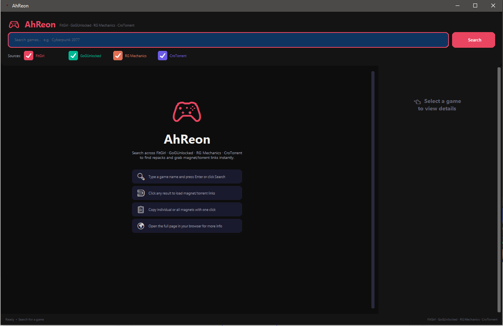
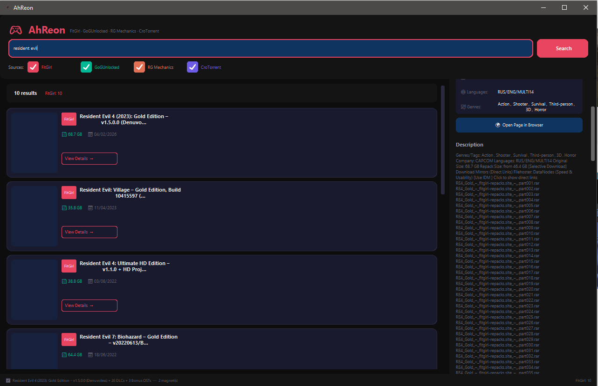

# AhReon
AhReon is a game finder tool that helps you quickly search and discover PC game repacks from popular repack sources. Built with Python and a clean GUI to make searching easier.  
Made with ❤ by Ahad

If you find any bugs or have feature ideas, feel free to open an issue.

---

# How To Use?
> [!WARNING]
> DON'T DELETE ANY FOLDER OR ITS CONTENT

You can download the compiled version from the [Releases](https://github.com/CruelDev69/AhReon/releases) page and run `AhReon.exe`.

Or you can run it manually using the steps below.

### Installation
1. Clone the repository
```
git clone https://github.com/CruelDev69/AhReon.git
```

2. Navigate into the project folder
```
cd AhReon
```

3. Install required dependencies
```
pip install -r requirements.txt
```

4. Run the application
```
py main.py
```

---

# Features

- [x] Search games from multiple repack sources
- [x] FitGirl Repacks support
- [x] DODI Repacks support
- [x] Fast scraping system
- [x] Clean and simple GUI
- [x] Game details preview
- [ ] Torrent direct integration
- [ ] Auto updater
- [ ] More repack sources

---

# Preview
***

<p align="center"></p>

<p align="center"></p>

***

---

# Note
This project is made for educational and research purposes.  

Please give proper credits if you use or modify the code.

Re-uploading or claiming the code as your own is not allowed.

---

# Social Media

[Instagram](https://www.instagram.com/ahad._.x19) ・  
[Discord](https://discord.gg/Ncsc5pRNgf) ・  
[Website](https://www.itscruel.cf/)

---

# Discord
Ahad#3257  

If you liked this repo please don't forget to ⭐ star it.